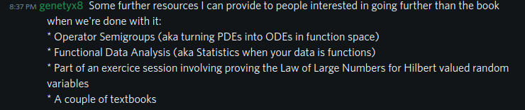
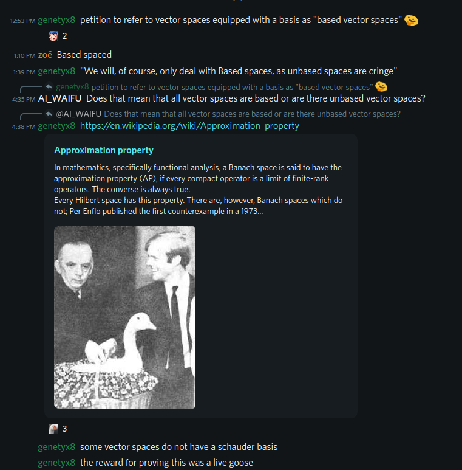
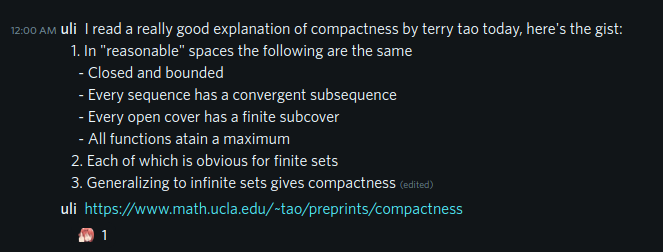
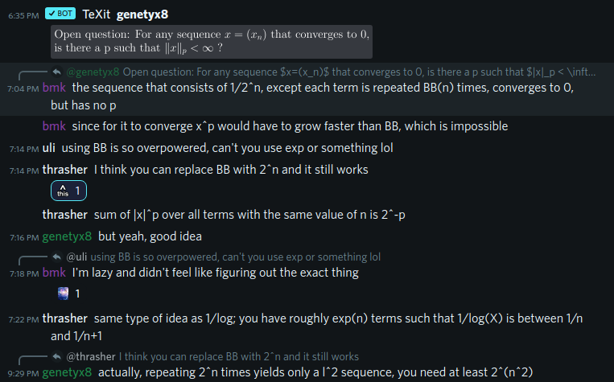
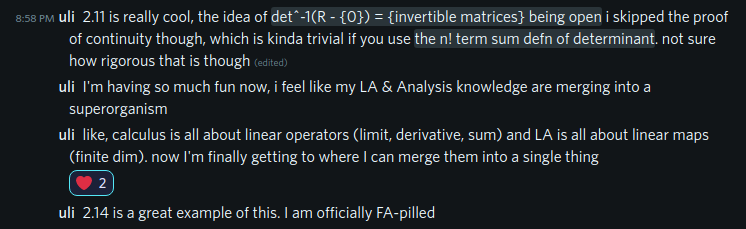
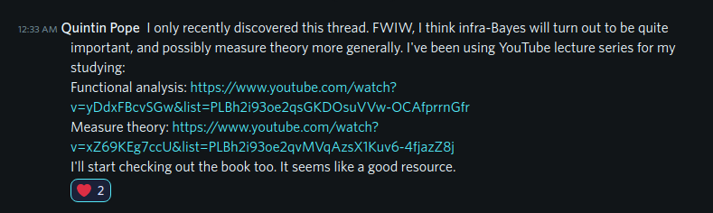
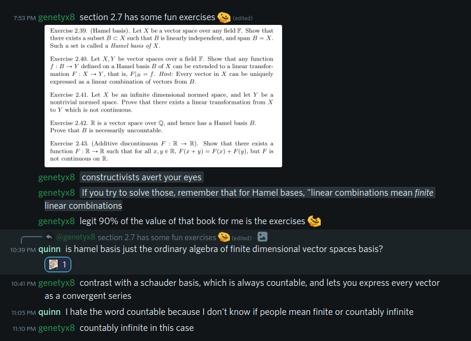

# EleutherAI Functional Analysis Reading Group

This repo contains the slides and links to the recordings of the EAI FA Reading Group.

## Recordings

* [Section 2.4](https://youtu.be/o4rtpUL3cTM)
* [Functional Derivatives](https://youtu.be/z5lDTH1Sp5k)
* [Euler-Lagrange Equations](https://youtu.be/qjrh5YNDYIM)
* [Inner Product Spaces](https://youtu.be/xG_tQfuYepQ)
* [Orthogonality](https://youtu.be/PF_jPwa_BlQ)

## Best moments

