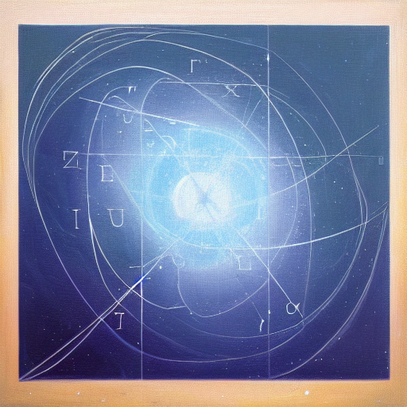
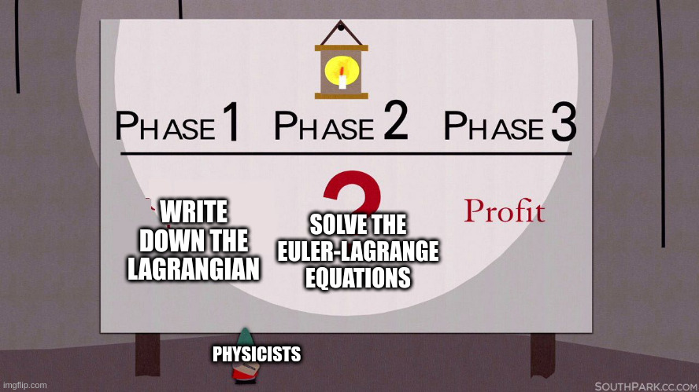
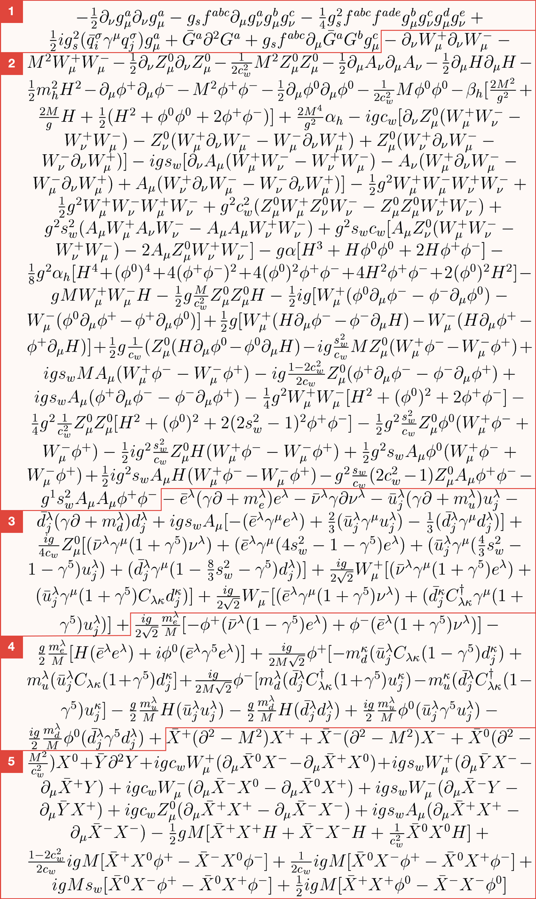
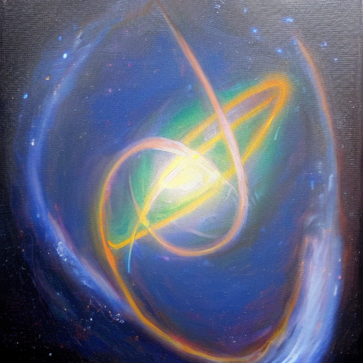
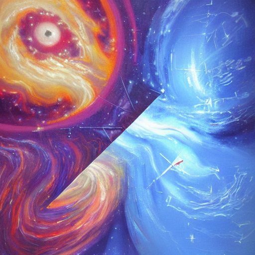

# Functional Analysis Reading Group
## The Euler-Lagrange Equations
28/08/2022

---
# Last meeting

- Generalized derivative of maps $f: X \rightarrow Y$
- Optimality conditions (stationary point + convexity)

Finding stationary points is generally not easy, though

---
# Today

- A way to turn a broad class of functional minimization problems into differential equations
- Secret sauce behind modern physics

---

"The Euler-Lagrange Equations, oil painting, trending on artstation HQ" generated with Stable Difusion

---
# Euler-Lagrange Equations
Given a functional of the form
$$  f(x) = \int_a^b F(x(t), x'(t), t) dt $$

Stationary points $x_*$ of $f$ satisfy the *Euler-Lagrange equation*
$$ \frac{\partial F}{\partial x}(x_*(t), x_*'(t), t) - \frac{d}{dt} \frac{\partial F}{\partial x'}(x_*(t),x_*'(t),t) = 0 $$

---
# Link with the functional derivative
Given a candidate stationary point $x_*$, consider the Banach space of perturbations
$$ X = \{ h \in C^1[a,b] : h(a) = h(b) = 0 \} $$
and the modified functional $\tilde{f}:X \rightarrow \mathbb{R}$
$$ \tilde{f}(h) = f(x_* + h) $$
Then $x_*$ is a stationary point of $f$ iff $D\tilde{f}(0) = 0$

---
# Example: Shortest path (euclidian norm)
Let $S = \{\gamma \in C^1([0,1],\mathbb{R}^n)~|~\gamma(0)=x_a, \gamma(1) = x_b\}$
$$ L_1(\gamma) = \int_0^1 \| \gamma'(t) \|_2 dt $$
The E-L equations yield
$$ \frac{d}{dt}\frac{\gamma_i'(t)}{\|\gamma'(t) \|_2} = 0 $$
which admits the solution
$$ \gamma(t) = (1-t)x_a + tx_b $$

---
# Newtonian mechanics
Given a point mass particle of mass $m$, subject to some force $F$, Newton's law describes the motion of the particle:
$$mq''(t) = F(q(t))$$
This can be reformulated using the Euler-Lagrange equations

---
# Lagrangian mechanics
Given some (1D) trajectory $q$, define its potential energy $V$ by
$$V(x) = -\int_{x_0}^x F(d\xi)d\xi $$
equivalently
$$ \frac{dV}{dx} = F(x) $$
and its kinetic energy as
$$K = \frac{m}{2}(q'(t))^2 $$

---
# Principle of stationary action
Define the *Action* of the system as
$$ A(q) = \int_{t_i}^{t_f} L(q(t), q'(t))dt $$
where $L(q(t),q'(t)) = \frac{m}{2}(q'(t))^2 - V(q(t))$ is the *Lagrangian* of the system

**Principle of Stationary action:** The motion $q(t)$ of the particle is a *stationary point* of the Action

---
# From Euler-Lagrange to Newton
The Euler-Lagrange equations are
$$ -\frac{dV}{dx}(q(t)) - \frac{d}{dt}(\frac{m}{2}.dq'(t)) = 0 $$
Injecting $\frac{dV}{dx}(x) = -F(x)$, we recover Newton's law
$$ mq''(t) = F(q(t)) $$

---
# Example: 2-body problem
Given a body of mass $m$, orbiting around a body of mass $M$, with polar coordinates $r, \varphi$
$$ f(r,\varphi) = \int_a^b \frac{m}{2}(r'(t))^2 + \frac{m}{2}(r(t)\varphi'(t)) + \frac{GMm}{r(t)} dt $$
yields the equations
$$ r''(t) = r(t)(\varphi'(t)) - \frac{GMm}{(r(t))^ 2} $$
$$ \frac{d}{dt}\left( m(r(t))^2 \varphi'(t) \right) = 0 $$

---
# Lagrangian mechanics
Beyond classical mechanics, most of modern physics can be framed in terms of the stationary action principle:
- Electromagnetism: $\mathcal{L} =  -\frac{1}{4\mu_0}F_{\mu\nu}F^{\mu\nu} - J^\mu A_\mu$
- General Relativity $\mathcal{L} = \frac{1}{2\kappa}R+ \mathcal{L}_M$
- Quantum mechanics*

Lagrangian mechanics provide a unifying language for physics!

---

---

---
# Conservation laws

Symmetries of the Lagrangian give rise to conservation laws
- The Energy $E = K + V$ is conserved
$$ E'(t) = (mq''(t) - F(q(t))).q'(t) = 0 $$
- If $L = L(q')$, the momentum $p = mq'(t) is conserved
$$ p'(t) = mq''(t) = -\frac{\partial L}{\partial x}(q(t), q'(t)) = 0 $$

See also: Noether's theorem

---
# Beyond Euler-Lagrange
Lagrangian mechanics can be further refined into *Hamiltonian mechanics*
(We won't get into it today, but they are fundamental in e.g. Quantum Mechanics)

---

 
