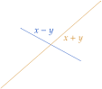

# Functional Analysis Reading Group
## Inner Product Spaces (section 4.1)
18/09/2022

---
# Welcome to chapter 4!
We're almost at the end

1. Inner Product spaces (we are here)
2. Orthogonality
3. Best Approximation
4. Generalized Fourier Series
5. Riesz Representation Theorem
6. Adjoints of bounded operators
7. An excursion in Quantum Mechanics

---
# Today's menu
Banach spaces are nice, but by default they lack several nice operations:

- Taking the "angle" between two vectors (~ cosine similarity)
- Orthogonality ($\rightarrow$ orthogonal bases)
- Solve shortest distance / best approximation problems

To do this, we'll need to generalize the *inner product* (dot product) to general vector spaces. In doing so, we'll be able to do *geometry* in function spaces.

---
# Inner Product space

Let $X$ be a vector space over $\mathbb{K}$ (= $\mathbb{R}$ or $\mathbb{C}$). A function $\langle \cdot,\cdot \rangle : X \times X \rightarrow \mathbb{K}$ is called an *inner product* on $X$ if:
- Positive definiteness
$\forall x \in X,~ \langle x,x\rangle \ge 0$ and $\langle x,x\rangle = 0~\Rightarrow x = 0$
- Linearity
$\forall x, y, z \in X, \langle x + y,z\rangle = \langle x,z\rangle + \langle y,z\rangle$
$\forall x, y \in X, \forall \alpha \in \mathbb{K}, \langle \alpha x,y\rangle = \alpha \langle x,y\rangle$
- Conjugate symmetry
$\forall x,y \in X, \langle x, y\rangle = \langle y,x\rangle^*$

---
# Inner products induce a norm
Any inner product space $X$ is a normed space with 
$$ \| x\| = \sqrt{\langle x,x \rangle} $$

But not all normed spaces are inner product spaces!

---
# Cauchy-Schwartz inequality

If $X$ is an inner product space, then $\forall x, y \in X$
$$ |\langle x,y\rangle| \le \|x\| \|y\| $$

Moreover, $|\langle x,y\rangle| = \|x\| \|y\|$ iff $x$ and $y$ are *linearly dependent* ($y = \lambda x$)

---
# Examples of Inner product spaces
- $\mathbb{R}^n$ ($\mathbb{C}^n$) with the euclidian norm
- $\ell^2$ (square summable sequences)
- $L^2[a,b] = \left\{ x:[a,b]\rightarrow \mathbb{K}~:~\int_a^b |x(t)|^2 dt < \infty \right\}$

---
# What's a Hilbert space?*

Inner Product + Banach (completeness)

---

# Parallelogram Law
If $X$ is an inner product space with induced norm $\| \cdot \|$, then $\forall x,y \in X$
$$ \|x+y\|^2 + \|x-y\|^2 = 2\|x\|^2 + 2\|y\|^2 $$

---
# Polarisation Identity

We can recover the inner product from the norm!

- Real case: $\langle x,y\rangle = \frac{\|x+y\|^2 - \|x-y\|^2}{4}$
- Complex case: $\langle x,y\rangle = \frac{\|x+y\|^2 - \|x-y\|^2 + i\|x+iy\|^2 - i\|x-iy\|^2}{4}$

We can use it to show that $\ell^2$ is the only $\ell^p$ space that is Hilbert, and e.g. that $(C[0,1], \|\cdot\|_\infty)$ is not Hilbert (Ex. 4.1)

---
# Further theorems

- Pythagoras's theorem
- The inner product is continuous (Ex. 4.3)
- Inner product on $m\times n$ matrices: $\langle A,B\rangle = tr(A^T B)$. Induces the *Hilbert-Schmidt* (Frobenius) norm. (Ex. 4.5)

---
# Completion of inner product spaces (Ex. 4.7)
Given an inner product space $(X, \langle \cdot,\cdot \rangle_X)$ that is incomplete, we can always construct "enlarge" $X$ into a space $\bar{X}$ such that
- $\bar{X}$ is complete
- $X$ can be identified with a subspace of $\bar{X}$

The proof is interesting, so we'll actually cover it's broad strokes.

---
# The main trick: take the set of Cauchy sequences on $X$

Let $\mathcal{C}$ be the set of Cauchy sequences on $X$, and define the following *equivalence relation* on $\mathcal{C}$:

$$(x_n)_{n\in \mathbb{N}} \sim (y_n)_{n\in \mathbb{N}} $$
$$ \Leftrightarrow \lim_{n\rightarrow\infty} \| x_n - y_n \|_X $$

Now let $\bar{X} = \mathcal{C}/\sim$, i.e. $\bar{X}$ is the set of equivalence classes of $\mathcal{C}$ under $\sim$.

We'll use $[x]$ to denote the equivalence class of $x = (x_n)_{n\in\mathbb{N}} \in \mathcal{C}$.

---
# $\bar{X}$ is a vector space

We can define vector space operations on $X$:

- $[x] + [y] = [(x_n + y_n)_{n\in\mathbb{N}}]$
- $\alpha \cdot [x] = [(\alpha x_n)_{n\in\mathbb{N}}]$

---
# $\bar{X}$ is an inner product space

We can define an inner product on $\bar{X}$:
$$\langle [x],[y]\rangle_{\bar{X}} = \lim_{n\rightarrow \infty} \langle x_n, y_n \rangle_X$$

We can also trivially embed $X$ into $\bar{X}$ by mapping $x\in X$ to $\iota(x) = [(x)_{n\in\mathbb{N}}]$ (the constant sequence of $x$'s) and moreover
$$\langle \iota(x),\iota(y)\rangle_{\bar{X}} = \langle x,y\rangle_X$$

---
# $\bar{X}$ is a Hilbert space

Let $([x^{(k)}])_{k\in\mathbb{N}} = ([(x_n^{(k)})_{n\in\mathbb{N}}])_{k\in\mathbb{N}}$ be a Cauchy sequence in $\bar{X}$. We will construct a sequence $y = (y_k)_{k\in\mathbb{N}}$ such that $([x^{(k)}])_{k\in\mathbb{N}}$ converges to $y$.

---
# Defining $y$

Since each $x^{(k)}$ is a Cauchy sequence, for each $k$, we can find $n_k$ such that $\forall m,n \ge n_k, \|x_n^{(k)} - x_m^{(k)}\| < \frac{1}{k}$.

Let $y_k = x^{(k)}_{n_k}$ be our candidate for the limit.

---
# Draw the rest of the proof

The rest of the proof goes as follows:

1. Let $\epsilon > 0$,
2. Some $\epsilon$ twiddling
3. $y \in \mathcal{C}$
4. Some more $\epsilon$ twiddling
5. $([x^{(k)}])$ converges to $[y]$

---
# More importantly

- We can take any inner product space and "complete it", by replacing its elements with equivalence classes of Cauchy sequences
- We can think of the Real numbers completing the rationals in the same way
- More generally, this construction can be adapted to complete *any* incomplete metric space

NB. This section unfortunately only considers real or complex vector spaces, so it's not fully general
